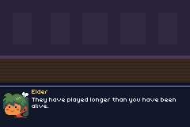

# visual-novel

> *A branching story on `packages/cutscene-core`: choices, portraits, and a flag set three scenes earlier being read back.*


Words, a face, and two decisions that matter. The elder's last line before you leave depends on both
of the choices you made — one of them four scenes earlier — which is the whole reason the flag store
exists.

| | |
|---|---|
|  | portraits are sprites, everything else is the canvas |

## Controls

- **A** — advance a line, and confirm a choice
- **up/down** — move between choices

## What it proves

**Text belongs on the background canvas.** `hud_text` allocates OBJ entries per glyph group and the
GBA has 128 for the whole machine, so a screen of prose written that way paints blocks and then runs
out. `ui_text` costs no OAM at all. A visual novel is the genre that would hit that ceiling first, so
it is the one that should hold the line.

**A line is drawn once, when it changes.** Nothing here animates, so an idle frame issues no `ui_*`
calls whatsoever — nine repaints for the whole story.

**It needs no game engine.** `package.json` lists `tish_agb` only: no entity system, nothing to step.
The sequencer runs on the four hooks `cutscene-core` asks for and `cutSetStep` is a bare `frame()`.

## Why it was broken, and what fixed it

It had never run. In order:

1. **No `package.json`** — it was not a workspace, so nothing built it.
2. **`ui_present` does not exist.** The file called it three times. Nothing in the crate presents a
   canvas; `ui_text` and `ui_rect` draw as you call them.
3. **Colours were palette indices.** `ui_rect`/`ui_text` take 24-bit RGB, so `1`/`2`/`3`/`4` drew the
   whole box in four shades of near-black on a black backdrop — invisible even once it compiled.
4. **The portrait was behind the box.** A plain sprite shares priority with the UI canvas background
   and the canvas won; the face was created, positioned and made visible on every line and never
   appeared once. `sprite_set_hud` puts it in screen space at the front.

## ⚠️ The scene change that cannot be built

The original had two rooms. It does not survive contact with the hardware, and the failure is worth
recording because it looks like a text bug: after the swap the box paints its rectangles correctly
and every word renders as orange blocks of the room's own floor tile — while `ui_mem_report` says 93
tiles of 2,880 and no overflow.

One background image is fine on its own; the story ran start to finish over a single room. Changing
it is what breaks. Tried and rejected:

| approach | what happens |
|---|---|
| `bg_clear()` + rebuild both | `bg_clear` takes the UI canvas with it; the rebuilt canvas loses its palette entries to the room |
| both rooms alive, `bg_set_visible` toggle | fixes the palette only if you also drop `bg_use_palettes` — then the glyph *tiles* collide instead |
| one 512x256 background, scrolled 256px | a wide map makes tiles resident as it scrolls, and they land on the canvas's glyphs |
| `ui_release_scratch`, smaller reserve, clear/commit/redraw split | no effect; it is not a reserve-size or peak-timing problem |

So the location is drawn with `ui_rect` **on the canvas itself**, the way `examples/solitaire` draws
an entire card table with no background image at all. One layer, no contention — and a game that
wants several locations can simply redraw that dozen rects.

## Build

```bash
npm run build && npm start
```

```bash
python3 scripts/gen_visualnovel.py
```
