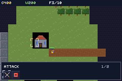

# WARFORGE



A Warcraft-shaped RTS campaign: harvest, build, train, and a hero who levels across three missions.

Warcraft 2's base-and-army loop with Warcraft 3's hero on top, on a d-pad. Your hero's level and
experience are the only things that survive a mission, which is what makes this a campaign rather
than three skirmishes.

## Controls

| Input | Action |
|---|---|
| D-pad | move the cursor |
| A | select the unit or building under the cursor · on open ground, order the selection there · while siting a building, place it |
| B | cancel — backs out of siting first, then clears the selection |
| **L** | **cycle the command card** |
| **START** | **run the highlighted command** |
| R | jump the cursor to your hero |
| SELECT | select every unit you own |

## The command card

Selecting anything opens its command card in the bottom bar — the thing that makes an RTS an RTS.
A d-pad cannot click a 3x3 grid of icons, so the card is a strip: `L` cycles, `START` runs, and the
bar shows the command, its cost and its position (`KEEP  300g 180w  2/2`). A command you cannot
afford is **dimmed rather than hidden** — a menu that hides what you cannot afford never teaches you
the economy.

| Selected | Commands |
|---|---|
| Town Hall | Train Peasant · Upgrade to Keep |
| Keep | Train Peasant |
| Barracks | Train Footman · Train Archer |
| Blacksmith | Upgrade Weapons · Upgrade Armour |
| Peasant | Build Farm / Barracks / Tower / Blacksmith · Mine · Chop · Stop |
| Footman · Archer · Hero | Attack · Stop |
| Farm · Tower | — (a farm feeds; a tower shoots on its own) |

Choosing a **Build** command enters siting mode: the bar goes modal, `A` commits if the footprint is
clear and affordable, `B` backs out. Nothing is charged until the site is accepted.

The card is **table driven** — [`src/cmd.tish`](src/cmd.tish) holds one flat `i32[]` of commands
terminated by `-1` per owner, with `CMD_AT` indexing into it. Adding a command to a building is one
entry in that table and one branch in `runCommand`; there is no per-building menu code.

### Seven buildings

| | cost | what it does |
|---|---|---|
| Town Hall | — | trains peasants, upgrades to a Keep |
| **Keep** | 300g 180w | the hall promoted: more hit points, +8 food. Replaces it in place |
| Farm | 60g 40w | +4 food cap |
| Barracks | 120g 80w | trains footmen and archers |
| **Tower** | 100g 60w | shoots. It is a pooled *unit* armed at the tower's foot with no move order, which reuses `set_soldier` whole rather than teaching combat about rectangles |
| **Blacksmith** | 160g 100w | +2 damage / +6 hit points per upgrade, applied to units armed afterwards |
| Enemy Camp | — | the thing you are here to break |

## The missions

1. **Take hold.** The full loop, and the first mission **on purpose**: a hall, a barracks and a farm
   already standing, three peasants ferrying gold and lumber, and everything on the command card
   available. The no-economy march used to open the campaign and the game read as "walk a character
   around" — the mission that shows this is an RTS has to be the one you see first.
2. **Break camp.** A hero and three footmen, no economy and nothing to build — a pure movement and
   attack-move map, which is a good mission and a bad introduction.
3. **Kill chief.** A defensible bowl with one choke. Reinforcements keep coming until the chieftain
   is dead, and your hero — carrying whatever levels it earned in 1 and 2 — is what kills him.

## Where the work happens

**Almost none of it is in this example.** Movement, pathing, combat and fog are native systems in
`crates/tish-gba-game-engine`, added for this game and measured before it was written:

| native | what it does |
|---|---|
| `flow_goal` / `flow_dist` | one breadth-first field per standing order, read by every unit in O(1) |
| `set_seek` | walk down a field to a destination — the sibling of `set_chase` (an entity) and `set_mover` (a pattern) |
| `set_soldier` | attack-move: acquire at 4× weapon range, close, swing, resume |
| `fog_init` / `set_vision` / `fog_blit` | a visibility grid and a wrapping shroud layer |

`packages/rts.tish` owns the roster, selection, orders, buildings, economy and production.
`src/main.tish` is the mission router, the input handler and the enemy commander — it runs on
button presses and slow timers, **never per unit per frame** (`docs/perf-rules.md` §7).

Three de-risk ROMs were built and measured first, in the de-risk-spike tradition:
[`rts-flow`](../rts-flow/README.md), [`rts-fog`](../rts-fog/README.md),
[`rts-select`](../rts-select/README.md).

## Frame budget

One 60fps frame is 4,389 ticks. Measured with `frame_period(2)`:

| | EMA | `world_step` |
|---|---|---|
| mission 1 | **4,375** | 1,386 |
| mission 2 | **4,377** | 1,785 |
| mission 3 | **4,376** | 2,088 |

A 12,000-frame headless soak through missions 1 and 2 reports **zero panics** and a settled EMA of
4,377.

Getting there took four fixes, and the first-cut numbers say why each one mattered:

1. **6,700 → 5,100: one job per frame.** Every call into `packages/rts` crosses a module boundary at
   ~117 ticks plus ~28 an argument. Sweeping the dead, stepping harvesters, ticking production,
   checking the objective and refreshing the HUD *all* ran every frame — about 4,000 ticks of
   bookkeeping on top of a 2,700-tick `world_step`. None of it needs 60Hz, so the loop now takes
   **one** job per frame on an eight-phase rotation.
2. **5,100 → 4,380: a periodic spike, not a slow average.** `siegeStep` scanned the whole roster
   with ~42 boxed calls on its visit — one frame in eight costing ~4,900 ticks while the other seven
   were comfortably inside budget. The average frame was *fine* and the game still ran at ~52fps.
   It now checks one unit per visit. **A spike is invisible to an average and obvious in the EMA.**
3. **Pools are sized per mission.** A parked pool slot is not free: `world_step` walks every slot of
   every system, and 26 dormant entities measured 2,631 ticks doing nothing. Mission 1 pools 5+4.
4. **`rtsReset` despawns.** Dropping the roster arrays between missions forgot the entity *ids* and
   left the entities in the world, so mission 2 ran at 6,632 when reached through mission 1 and
   4,377 when booted into directly. A leak that only appears on the *second* scene.

## Four bugs worth keeping

- **Off-screen culling is wrong for an RTS.** An opt-in `set_cull_offscreen` was built to stop
  parked pool slots being simulated. It saved ~600 ticks and broke the game: an army ordered across
  the map walks off screen and must keep walking. The engine comment now says so.
- **The last canvas tile row does not paint.** A HUD bar flush with y=160 rendered its rect but
  dropped its glyphs. It sits at y=136 now.
- **The UI canvas spills into the shroud layer.** Left to grow on demand it corrupted the fog into
  orange patches *and* truncated the HUD — two symptoms, one cause, neither of which looks like
  "reserve more tiles". `ui_reserve_tiles` is called before the shroud layer is built.
- **Buildings need eight neighbours, not four.** Units ordered beside a building settle on the
  *diagonal* of its corner; the army stood next to the enemy camp for a thousand frames without
  touching it.

## The art is drawn, not vendored

Every pixel comes from [`scripts/wf_art.py`](../../scripts/wf_art.py) — terrain, buildings, units and
cursor — in the idiom of v3x3d's *Mini Medieval* (studied from its screenshots, not copied: that pack
is paid). The look is a build artifact, so a palette swap or a new unit kind is a code change.

**Units are 8x8; terrain is 16x16**, because tiles are addressed as 16px cells throughout
`tilemap_set`. So terrain is drawn at 16px with *8px-scale detail* and buildings are 2x2 cells
(32x32), where the reference's houses sit. What the reference teaches turns out to be about
silhouette, not size:

- A first pass drew the head as wide as the body and hid the legs under the torso. Every unit came
  out an identical 4x6 rectangle and no colour rescued it. **Narrow head, gapped legs.**
- A grey sword on grey armour is invisible. Weapons are cream, always.
- The forest canopy used a green a few values off the grass and the treeline **vanished into the
  field**. At this size a tree is distinguished by value, not hue.
- The farm read as a cupboard, then a bookshelf: a brown rectangle crossed by straight dark
  horizontal bars **is** a shelf. The bars had to go entirely.
- The gable roofs were built widest at the ridge — upside down.
- **The cursor must not look like a unit.** It borrowed a hero sprite at first and the whole game
  read as "walk a character around" instead of "command an army". It is now a bracket.

## Two things that decided the whole build

**The base mission goes first.** The no-economy march used to open the campaign, so the game began
with a hero and three soldiers on an empty map — nothing to build, nothing to harvest. The mission
that shows this is an RTS has to be the one you see first.

**warforge does not use `scene:`.** The Tiled pipeline bakes an atlas from the tiles a map uses while
the fog needs the whole tileset; two bakers over one PNG give two palette orderings, and the GBA has
one set of background palettes, so one layer always drew in the other's colours (measured: a black
map one way round, a brown shroud the other). Terrain streams from arrays through a single asset
instead — `terrain_load` / `terrain_blit`. Related: `bgtiles:` rather than `background:`, because the
latter bakes with agb's `deduplicate`, which shortens `tile_settings` while the index math assumes a
full grid — every tile past the shortened length silently fails to draw, which is why the shroud
(index 9) drew nothing while rock (index 8) drew fine.

## Known issue: harvesting does not credit resources

The economy is **wired but not delivering**. Gold and lumber sit at their starting values. The
peasants exist and are given harvest orders, the ledger and HUD update correctly when credited by
hand, but the round trip does not complete.

Three causes were found and fixed and it still does not accrue, so start from what is ruled out:

- **The two legs of the trip need two flow fields.** Sharing one meant an outbound worker re-goaled
  the field under a returning one and the crew followed whoever moved last. `MAX_FLOWS` went 4 → 6
  and `rtsHarvestStep` takes a separate `homeField`. Correct, and not sufficient.
- **Two of three peasants spawned inside the mine's solid footprint**, embedded in rock.
- **`dwell` counts VISITS, not frames.** The rotation reaches a worker about every 40 frames, so the
  original 90 was 3,600 frames of standing in the mine.

The remaining suspicion is that workers never satisfy `seek_arrived` at the node: the state machine
advances only on arrival, so a worker stopping a pixel outside its arrive radius waits forever.
Logging `seek_arrived` and the worker's cell per visit is the next step.

Everything else in the mission works: the base stands, buildings stamp and select, production
charges and queues, fog reveals and hides enemy units, combat resolves, and the campaign advances
when the enemy camp falls. `verify.sh` reports **one failure** — "campaign advances past mission 1",
because its scripted play-through cannot cross the larger base map to break the camp within its
frame budget. The check is correct and is left failing rather than weakened.

## Build

```bash
npm run assets --workspace=warforge
npm run build --workspace=warforge
npm start --workspace=warforge
bash verify.sh
```

Assets are generated from the CC0 Ninja Adventure pack by
[`scripts/gen_warforge.py`](../../scripts/gen_warforge.py), which also emits `src/mapdata.tish` so
the mission constants cannot drift from the maps that contain them.
