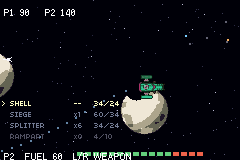

# WARHEADS

> *Pick a hull, choose a rock, and take turns dismantling the solar system it is standing on.*



Turn-based artillery in space, in the classic turn-based artillery line: three ship classes, a scrolling starfield
strewn with planets, and shots that bend through the gravity wells on their way to the other side of
the board. Every planet is **destructible to the pixel**, and the gravity follows what is left of it
— blow a world's core out and it stops pulling like a world.

Plays solo against a CPU that searches with the game's own integrator, or head to head over the
**link cable**.

## Controls

| | |
|---|---|
| LEFT / RIGHT | heading |
| UP / DOWN | power |
| L / R | rack: four guns, then JUMP |
| A | fire the selected entry |
| START | rematch |

It plays itself until you touch the pad.

```bash
npm run assets && npm run build && npm start
```

```bash
npm run verify
```

## What is actually hard here

`examples/artillery` is the spike this was built from: it pinned down N-body inverse-square gravity
integrated in pure integer tish, on a chip with **no floating-point unit and no divide instruction**.
Everything below is what the full game added on top, and each item is something that was wrong first.

### Terrain is per pixel, and gravity reads it

Planets are drawn into a `terrain_*` layer — a 1-bit occupancy bitmap plus sparse `DynamicTile16`s —
so a crater is a crater, not a missing 8x8 cell. A tile-resolution version was built first and
looked, in the reviewer's words, hideous.

Gravity then has to follow the damage. A planet modelled as a point mass at its centre keeps pulling
from that centre after the centre has been blown away, so anything falling in gets held at a core
that is no longer there — ships orbited inside hollowed-out worlds for ever. The fix is the shell
theorem: what pulls you at distance *d* is the mass **enclosed** within *d*, sampled by
`terrain_mass` into four rings per planet and re-measured after every blast.

⚠️ **Three sites read that table and all three must use it.** The hull integrator did; the shell
integrator computed the enclosed mass into a local and then multiplied by the planet's full mass
anyway, so shells were still dragged into dead cores and orbited until their TTL. `verify.sh` now
fails on any shell that reaches its TTL at all, because on screen a trapped shell is indistinguish-
able from a player who missed.

### The planets are generated, not sprites

`terrain_planet` is a port of the technique in
[Deep-Fold's Pixel Planet Generator](https://deep-fold.itch.io/pixel-planet-generator) (MIT) into
integer arithmetic: project the disc onto a sphere, sample fractal value noise in that projected
space, posterise into a handful of flat tones, cut with a hard terminator and ring it with a dark
limb. The posterising is what gives the style its look — worlds made of flat regions of colour
rather than gradients — and it is also exactly what a 16-colour background palette can hold.

⚠️ **Generated rather than stamped is a requirement here, not a preference.** The terrain is
destructible to the pixel, so every pixel a crater exposes needs a colour; and the arena draws a
radius per planet per match, which no fixed 48x48 or 96x96 planet sprite can serve without scaling
artefacts at one end or the other.

⚠️ **The palette was the limit, not the shader.** With every planet drawing from one shared bank,
four worlds split fifteen colours — about four each — and no amount of shading work could stop them
looking like flat slabs of a single hue. But a 4bpp GBA background stores a **palette bank per
tile**, so one layer can hold several sixteen-colour palettes at once, and planets never share a
tile (placement keeps them 56 px apart). A bank per planet gives each of them fifteen colours:
**three materials of five tones**, indexed arithmetically as `1 + material * 5 + shade`.

Two axes, deliberately different in character:

- **Material** — sea/land/cloud, basalt/ash/lava — comes from the noise with **hard** edges, because
  hard edges are what read as coastlines.
- **Shade** comes from the light and is **ordered-dithered** through a 4x4 Bayer threshold. Five
  tones across a sphere is four visible bands otherwise; dithering the boundary is the trick the
  reference planets use to look smoothly lit on a sixteen-colour palette.

Classes are dealt **without replacement**, and size is drawn separately from material — drawing each
planet's class independently produced arenas of four identical worlds often enough to be the normal
case.

JUMP is a **rack entry, not a button**. It spends the same heading and power a gun does and is the
same one-action-per-turn choice — a sustained burn in space, a single committed hop when landed. On
its own key it was a mechanic most players never found.

### A weapon is a shot plus a warhead, and the two are independent

The **shot** is delivery — how many leave the tube, whether they open mid-flight, whether they bore
through rock. The **warhead** is arrival — crater size, damage, falloff, and whether it *removes*
ground or *lays* it. Nothing about one implies the other, so a fan of builders raises three walls at
once and a splitter of diggers opens a shaft cluster, from one row of three numbers in
[`src/ships.tish`](src/ships.tish) rather than a new branch in the flight loop.

### The CPU searches with the real integrator

Sixteen bearings around the **whole circle** at one charge, then sixteen refinements around the best
at two — flown through the same code a fired shell uses, over the same probe slot the aim preview
uses. The full circle is the point: with four wells on the board the shot that lands is often the one
fired away from the target and slung round something, and an arc-limited search can never find it.

Two rules make it affordable and safe:

- **The budget is in integrator substeps, not ticks and never a wall clock.** A tick costs one
  substep when the shell is slow and eight when it is fast, so a tick budget varies 8x with the
  candidate; and `timer_read()` would stop the search at a different candidate on two consoles
  running the same match.
- **A side that already has a solution skips the coarse sweep** and spends its budget refining what
  it remembers — a big rethink after a miss, a small correction after a near one.

### Lockstep, and the assertion no screenshot can make

The link half reuses `packages/link.tish` and the master-owns-the-clock loop from
`examples/pong-link` — 9 button bits and 5 round bits in exactly 14, held buttons on the wire with
edges computed *inside* `step`, solo as a waiting room rather than a mode.

`verify.sh` is deliberately not original: it reuses pong-link's desync differ verbatim, and this ROM
prints `SYNC f=<n> …` in pong-link's exact format so the comparison works unadapted. A desynced
lockstep game is the hardest kind of bug to see — each console shows a completely plausible artillery
duel, they are simply not the same duel.

⚠️ **No CPU in a linked match**, and the suite asserts it.

### The HUD is a layout tree

Health is a **bar**, not a number — a length the eye reads without parsing, which is what you want
from something glanced at mid-flight. Each is a quarter of the screen wide, so four fit across the
top when four-player boards arrive.

The rack is **only in the tree while aiming**. Once a shell is in the air the rack is a wall of text
over the interesting part of the screen, and the shot now says what it is: every warhead kind has
its own projectile sprite. Dropping the node *is* the mechanism — no visibility flag, no clear-rect.

⚠️ **packages/ui owns the canvas** (`uiRender` calls `ui_begin()` and clears), so everything drawn
during a match lives in one tree. Three things that cost real frames until they were measured:

- Key the repaint on **what the HUD shows**, not the raw phase. Keying on the phase meant four
  full-canvas relayouts per turn and cost ~700 ticks a frame, sustained.
- Pump the streamer only when `uiPaintBusy()`.
- A selection change **edits nodes in place** with `uiSetText`. Rebuilding the tree is a streamed
  full-canvas relayout — about a second of visible redraw for a change that moves one marker.

⚠️ **A phase only a human can reach is a phase with no test.** The landed jump was gated on space
mode — the same arm that held its own exit — so a landed hop entered a phase nothing could leave and
the game froze. It survived twelve thousand frames of soak and twenty-eight green checks because the
driver always wrapped past JUMP in the rack. The driver now takes the hop every fourth turn, and the
suite asserts the match continues afterwards.

## Frame budget

A GBA frame is 4,389 ticks. Sustained cost is ~3,950 of them. ⚠️ **Adopting `packages/ui` for the
HUD accounts for about 900 of that** — a layout engine repaints the whole canvas, and this HUD
changes twice a turn. Measured three ways: streamed at the library's default budget, 4,219 average
with a 42,000-tick worst frame; streamed at budget 24, 3,986 and 34,000; painted in one go, 3,901
and 64,000 — a fourteen-frame stall. Budget 24 ships. Presentation went from ~550 ticks a frame to
~1,400. Seven things that were measured, not
guessed — every one of them found by reading telemetry rather than by reasoning about the code:

| what | was | now |
|---|---|---|
| the frame each turn begins | 20,923 | the weapon panel paints one row per frame |
| the frame each shell lands | 14,539 | enclosed mass re-measured one disc scan per tick |
| a dead shell in the flight loop | full tick budget spent integrating a shell that had stopped | breaks out |
| carving a crater | occupancy written one bit at a time | masked word writes |
| generating a world | 59,766 in one frame | 32 bands, one per tick |
| the sphere's z, per pixel | a 12-iteration integer isqrt | a 1 KB table |
| the surface, per pixel | two octaves = eight hashes | one 64x64 tile baked per world |

⚠️ **mGBA's FPS counter cannot see any of this.** It measures the emulated LCD, which reads 60
whether or not the game finished its frame.

## Art

Ships are the Kla'ed faction from [Foozle's CC0 Void fleet pack](https://foozlecc.itch.io/void-fleet-pack-1),
vendored under `assets/void/`. `scripts/gen_warheads.py` rotates them a quarter turn (the pack is
drawn for a vertical shmup; this game aims with 0 pointing right), crops to the alpha bounding box
and scales all three by **one common factor**, so the classes keep the size relationship the artist
drew.

Hulls carry **four frames each**: at rest, then three phases of the pack's own engine-flame layer
composited on. ⚠️ All four share ONE crop box — the union of the hull with every flame — because
cropping each frame to its own alpha bounds re-centres the ship whenever the flame changes length,
and the hull jitters a pixel or two the whole time the engine is lit.

Three things that pack art needs and does not come with:

- **Scout / Frigate / Bomber, chosen by native size as much as by role.** The Dreadnought is 100x72
  px of panelling; at the ~20 px a ship may occupy beside these planets, no filter saves a 5x
  reduction.
- **Dilate before downscaling.** Outside the hull the pack stores transparent *black*, and a
  resampling filter mixes those zeros into every edge pixel — a dark halo, and a soft alpha edge that
  the GBA (which has no per-pixel alpha) then thresholds into a ragged one.
- **One sheet per team.** A sheet is one palette bank, so six hulls on one sheet share fifteen
  colours between two liveries. Split, each gets all fifteen; the second is a hue rotation, which
  preserves the shading a two-colour tint destroys.

## Files

| | |
|---|---|
| [`src/main.tish`](src/main.tish) | the game: integrator, phases, link protocol, presentation |
| [`src/ships.tish`](src/ships.tish) | hull stats and the shot x warhead tables |
| [`src/tables.tish`](src/tables.tish) | generated `GACC` / `SQ` / `ISQRT` / `SINT` / `COST` |
| [`scripts/gen_warheads_tables.py`](../../scripts/gen_warheads_tables.py) | writes `tables.tish` |
| [`scripts/gen_warheads.py`](../../scripts/gen_warheads.py) | writes the sheets from the Void pack |
| [`verify.sh`](verify.sh) | 28 checks: one console, two consoles, and the ready gate |

## Credits

Ships and backdrop: [Foozle](https://foozlecc.itch.io/void-fleet-pack-1), CC0. Planet generation
technique: [Deep-Fold](https://deep-fold.itch.io/pixel-planet-generator), MIT — ported, not copied;
no pixels from that project are in this repo.
