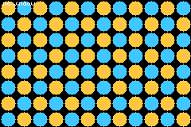
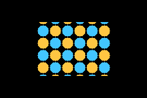

# win-demo

> *The GBA's window registers, reachable from tish for the first time: a rectangle, a per-scanline circular iris, and darkness everywhere else.*



Three phases on a loop over a checkerboard: no window, then `win_rect` + `win_out_layers(0)`, then
`win_circle` irising closed and open.

| | |
|---|---|
|  | `win_rect(0, 60, 36, 120, 88)` with the outside masked off |

## Why this ROM is tiny

It is a repro, not a game. The window registers had never been exposed to tish, so the first
question is not "does a stealth game feel good" but "does the hardware do what the native says" —
and `docs/MEMORY.md` is blunt that a five-minute build is not a debugging loop. Everything here is
chosen so a wrong answer is unmistakable in a single screenshot: if the outside is not black,
`win_out_layers(0)` did not take; if the circle is a rectangle, the DMA did not arm; if its edges
are ragged, the isqrt is wrong.

## The natives

```
win_rect(id, x, y, w, h)      enable window 0 or 1 over a screen rectangle
win_circle(cx, cy, r)         WIN0 as a circle — a spotlight, or an iris
win_off(id)                   disable it
win_in_layers(id, mask)       which layers draw INSIDE window id
win_out_layers(mask)          which layers draw OUTSIDE every window — pass 0 for darkness
```

**The mask is by draw order, not by handle**: bit 0..3 are the nth background actually *shown* this
frame, bit 4 objects, bit 5 blending. A background's slot depends on what else is visible — opening
a dialog changes it — so a mask keyed to a handle would quietly start pointing at another layer.

**The circle is per-scanline.** The hardware window is a rectangle; the circle comes from rewriting
WIN0's horizontal extent on every scanline through an HBlank DMA. ⚠️ There is exactly one HBlank DMA
slot per frame in this agb fork, so a circle window and a `bg_bands` banded layer cannot both run on
the same frame — the same single-channel limit `scene_bands` already lives under.

## The bug worth keeping

The first build drew a perfect circle of **darkness** with the checkerboard outside it. That looks
like an inverted mask and is really two swapped bytes: the register is `(left << 8) | right`, and a
`Vector2D<u8>` lays `x` down in the **low** byte — so `x` must carry the RIGHT edge. Written the
intuitive way round, every span comes out with X1 > X2, which the GBA treats as the wrap-around
window (`x >= X1 or x < X2`), i.e. exactly the complement of the shape you asked for.

## What this unlocks

Stealth vision cones and alert lighting, a lit room in a dark dungeon, spotlight cutscenes, and iris
transitions for `packages/scene.tish` — none of which were expressible before, because `fade` and
`fx_flash` are whole-screen effects with no way to cut a hole in them.

## Build

```bash
npm run build && npm start
```

---

This is a hardware probe, not a transition library. The iris here is six lines of inline phase maths
over a static screen — it proves `win_circle` works, and nothing about what happens when a scene
actually changes underneath it. For that, and for the other ten effects, see
[`examples/transitions`](../transitions) and `packages/transition.tish`.
